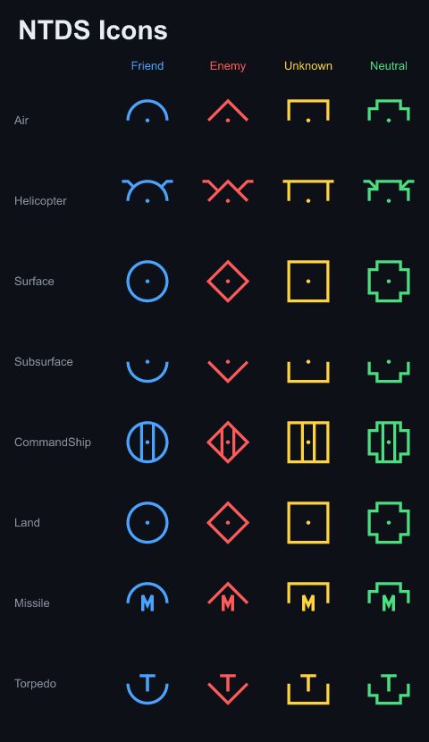

# NTDS Icons

An installable **NTDS (Naval Tactical Data System) tactical-symbol outline
font** — the older, naval, *outline* symbology set, packaged as a TrueType /
WOFF2 icon font with a documented Private-Use-Area codepoint map.



**▶ Browse the live gallery — [peterellisjones.github.io/ntds-icons](https://peterellisjones.github.io/ntds-icons/)** — every glyph rendered in the font, affiliation-colored, with click-to-copy codepoints, search/filter, and a base + heading-vector + BDA **composition demo**.

## What this is — and the gap it fills

There are good fonts for the modern **NATO/joint** symbology — **MIL-STD-2525**
and **APP-6A** (filled, land-centric; e.g. [MapSymbs](http://www.mapsymbs.com/)).
There was **no good standalone NTDS font**.

NTDS is the older **naval** set and is visually distinct:

- **Outline** shapes, not filled.
- A **square** for the *unknown* affiliation (vs 2525's club/quatrefoil).
- The same warfare-area encoding by how the shape opens: **closed = surface,
  top-open = air, bottom-open = subsurface**.

Academic references and prototypes exist, but nothing installable as a font.
This is that font.

See the symbology in real use in the
[dronecom manual's symbology chapter](https://dronecomgame.com/manual/symbology.html).

## Install

Grab [`assets/ntds_icons.ttf`](assets/ntds_icons.ttf) (desktop) or
[`assets/ntds_icons.woff2`](assets/ntds_icons.woff2) (web). The glyphs live in
the Private Use Area (`U+E000..U+E0A9`).

```css
@font-face {
  font-family: "NTDS Icons";
  src: url("ntds_icons.woff2") format("woff2"),
       url("ntds_icons.ttf") format("truetype");
}
```

The symbology only reads correctly **in color** — drive the fill from
affiliation (friend / unknown / enemy / neutral), not the font.

## Codepoint cheat-sheet

Glyphs are assigned sequentially from `U+E000`, packed into eight categories
with no gaps:

| Range        | Count | Category                                        |
|--------------|-------|-------------------------------------------------|
| `E000–E01F`  | 32    | base symbols, construction-centered (8 class × 4 affiliation) |
| `E020–E021`  | 2     | BDA decorations (zero-advance overlays)         |
| `E022–E069`  | 72    | heading vectors at 5° steps (zero-advance overlays) |
| `E06A–E089`  | 32    | base symbols, geometric-centered (for buttons/labels) |
| `E08A–E095`  | 12    | group symbols, construction-centered (3 class × 4 affiliation) |
| `E096–E0A1`  | 12    | group symbols, geometric-centered               |
| `E0A2–E0A5`  | 4     | flat unknown-class (bare affiliation outline)   |
| `E0A6–E0A9`  | 4     | flat unknown-class, geometric-centered          |

The **construction-centered** base/group glyphs share an origin so the
zero-advance **heading** and **BDA** overlays composite on top like combining
marks (e.g. a Surface/Friend symbol followed by `heading.090` renders the
symbol with a heading stalk). The **geometric-centered** variants are shifted
to their perceived visual center for clean alignment in buttons and labels, and
do not take overlays.

GitHub can't render a custom PUA font inline, so the table below is static; the
machine-readable map is [`assets/codepoints.json`](assets/codepoints.json), and
the specimen image above shows the base set rendered.

<details>
<summary>Full codepoint table (170 glyphs)</summary>

| Codepoint | Glyph name |
|---|---|
| `U+E000` | `Air.Friend` |
| `U+E001` | `Air.Enemy` |
| `U+E002` | `Air.Unknown` |
| `U+E003` | `Air.Neutral` |
| `U+E004` | `Helicopter.Friend` |
| `U+E005` | `Helicopter.Enemy` |
| `U+E006` | `Helicopter.Unknown` |
| `U+E007` | `Helicopter.Neutral` |
| `U+E008` | `Surface.Friend` |
| `U+E009` | `Surface.Enemy` |
| `U+E00A` | `Surface.Unknown` |
| `U+E00B` | `Surface.Neutral` |
| `U+E00C` | `Subsurface.Friend` |
| `U+E00D` | `Subsurface.Enemy` |
| `U+E00E` | `Subsurface.Unknown` |
| `U+E00F` | `Subsurface.Neutral` |
| `U+E010` | `CommandShip.Friend` |
| `U+E011` | `CommandShip.Enemy` |
| `U+E012` | `CommandShip.Unknown` |
| `U+E013` | `CommandShip.Neutral` |
| `U+E014` | `Land.Friend` |
| `U+E015` | `Land.Enemy` |
| `U+E016` | `Land.Unknown` |
| `U+E017` | `Land.Neutral` |
| `U+E018` | `Missile.Friend` |
| `U+E019` | `Missile.Enemy` |
| `U+E01A` | `Missile.Unknown` |
| `U+E01B` | `Missile.Neutral` |
| `U+E01C` | `Torpedo.Friend` |
| `U+E01D` | `Torpedo.Enemy` |
| `U+E01E` | `Torpedo.Unknown` |
| `U+E01F` | `Torpedo.Neutral` |
| `U+E020` | `bda.Uncertain` |
| `U+E021` | `bda.ProbablyDestroyed` |
| `U+E022` | `heading.0` |
| `U+E023` | `heading.5` |
| `U+E024` | `heading.10` |
| `U+E025` | `heading.15` |
| `U+E026` | `heading.20` |
| `U+E027` | `heading.25` |
| `U+E028` | `heading.30` |
| `U+E029` | `heading.35` |
| `U+E02A` | `heading.40` |
| `U+E02B` | `heading.45` |
| `U+E02C` | `heading.50` |
| `U+E02D` | `heading.55` |
| `U+E02E` | `heading.60` |
| `U+E02F` | `heading.65` |
| `U+E030` | `heading.70` |
| `U+E031` | `heading.75` |
| `U+E032` | `heading.80` |
| `U+E033` | `heading.85` |
| `U+E034` | `heading.90` |
| `U+E035` | `heading.95` |
| `U+E036` | `heading.100` |
| `U+E037` | `heading.105` |
| `U+E038` | `heading.110` |
| `U+E039` | `heading.115` |
| `U+E03A` | `heading.120` |
| `U+E03B` | `heading.125` |
| `U+E03C` | `heading.130` |
| `U+E03D` | `heading.135` |
| `U+E03E` | `heading.140` |
| `U+E03F` | `heading.145` |
| `U+E040` | `heading.150` |
| `U+E041` | `heading.155` |
| `U+E042` | `heading.160` |
| `U+E043` | `heading.165` |
| `U+E044` | `heading.170` |
| `U+E045` | `heading.175` |
| `U+E046` | `heading.180` |
| `U+E047` | `heading.185` |
| `U+E048` | `heading.190` |
| `U+E049` | `heading.195` |
| `U+E04A` | `heading.200` |
| `U+E04B` | `heading.205` |
| `U+E04C` | `heading.210` |
| `U+E04D` | `heading.215` |
| `U+E04E` | `heading.220` |
| `U+E04F` | `heading.225` |
| `U+E050` | `heading.230` |
| `U+E051` | `heading.235` |
| `U+E052` | `heading.240` |
| `U+E053` | `heading.245` |
| `U+E054` | `heading.250` |
| `U+E055` | `heading.255` |
| `U+E056` | `heading.260` |
| `U+E057` | `heading.265` |
| `U+E058` | `heading.270` |
| `U+E059` | `heading.275` |
| `U+E05A` | `heading.280` |
| `U+E05B` | `heading.285` |
| `U+E05C` | `heading.290` |
| `U+E05D` | `heading.295` |
| `U+E05E` | `heading.300` |
| `U+E05F` | `heading.305` |
| `U+E060` | `heading.310` |
| `U+E061` | `heading.315` |
| `U+E062` | `heading.320` |
| `U+E063` | `heading.325` |
| `U+E064` | `heading.330` |
| `U+E065` | `heading.335` |
| `U+E066` | `heading.340` |
| `U+E067` | `heading.345` |
| `U+E068` | `heading.350` |
| `U+E069` | `heading.355` |
| `U+E06A` | `geo.Air.Friend` |
| `U+E06B` | `geo.Air.Enemy` |
| `U+E06C` | `geo.Air.Unknown` |
| `U+E06D` | `geo.Air.Neutral` |
| `U+E06E` | `geo.Helicopter.Friend` |
| `U+E06F` | `geo.Helicopter.Enemy` |
| `U+E070` | `geo.Helicopter.Unknown` |
| `U+E071` | `geo.Helicopter.Neutral` |
| `U+E072` | `geo.Surface.Friend` |
| `U+E073` | `geo.Surface.Enemy` |
| `U+E074` | `geo.Surface.Unknown` |
| `U+E075` | `geo.Surface.Neutral` |
| `U+E076` | `geo.Subsurface.Friend` |
| `U+E077` | `geo.Subsurface.Enemy` |
| `U+E078` | `geo.Subsurface.Unknown` |
| `U+E079` | `geo.Subsurface.Neutral` |
| `U+E07A` | `geo.CommandShip.Friend` |
| `U+E07B` | `geo.CommandShip.Enemy` |
| `U+E07C` | `geo.CommandShip.Unknown` |
| `U+E07D` | `geo.CommandShip.Neutral` |
| `U+E07E` | `geo.Land.Friend` |
| `U+E07F` | `geo.Land.Enemy` |
| `U+E080` | `geo.Land.Unknown` |
| `U+E081` | `geo.Land.Neutral` |
| `U+E082` | `geo.Missile.Friend` |
| `U+E083` | `geo.Missile.Enemy` |
| `U+E084` | `geo.Missile.Unknown` |
| `U+E085` | `geo.Missile.Neutral` |
| `U+E086` | `geo.Torpedo.Friend` |
| `U+E087` | `geo.Torpedo.Enemy` |
| `U+E088` | `geo.Torpedo.Unknown` |
| `U+E089` | `geo.Torpedo.Neutral` |
| `U+E08A` | `group.Air.Friend` |
| `U+E08B` | `group.Air.Enemy` |
| `U+E08C` | `group.Air.Unknown` |
| `U+E08D` | `group.Air.Neutral` |
| `U+E08E` | `group.Surface.Friend` |
| `U+E08F` | `group.Surface.Enemy` |
| `U+E090` | `group.Surface.Unknown` |
| `U+E091` | `group.Surface.Neutral` |
| `U+E092` | `group.Submarine.Friend` |
| `U+E093` | `group.Submarine.Enemy` |
| `U+E094` | `group.Submarine.Unknown` |
| `U+E095` | `group.Submarine.Neutral` |
| `U+E096` | `geo.group.Air.Friend` |
| `U+E097` | `geo.group.Air.Enemy` |
| `U+E098` | `geo.group.Air.Unknown` |
| `U+E099` | `geo.group.Air.Neutral` |
| `U+E09A` | `geo.group.Surface.Friend` |
| `U+E09B` | `geo.group.Surface.Enemy` |
| `U+E09C` | `geo.group.Surface.Unknown` |
| `U+E09D` | `geo.group.Surface.Neutral` |
| `U+E09E` | `geo.group.Submarine.Friend` |
| `U+E09F` | `geo.group.Submarine.Enemy` |
| `U+E0A0` | `geo.group.Submarine.Unknown` |
| `U+E0A1` | `geo.group.Submarine.Neutral` |
| `U+E0A2` | `Unknown.Friend` |
| `U+E0A3` | `Unknown.Enemy` |
| `U+E0A4` | `Unknown.Unknown` |
| `U+E0A5` | `Unknown.Neutral` |
| `U+E0A6` | `geo.Unknown.Friend` |
| `U+E0A7` | `geo.Unknown.Enemy` |
| `U+E0A8` | `geo.Unknown.Unknown` |
| `U+E0A9` | `geo.Unknown.Neutral` |

</details>

## Rust crate

The font is generated by — and its geometry is reusable from — the `ntds-icons`
crate. **The default build is `std`-only** (no font-generation deps), exposing
the pre-built font and the lookups:

```rust
use ntds_icons::FONT_TTF;
use ntds_icons::codepoints::{glyph, heading_glyph};
use ntds_icons::shapes::{NtdsShapeClass, ShapeAffiliation};

// PUA char for a tactical symbol:
let c: char = glyph(NtdsShapeClass::Surface, ShapeAffiliation::Friend); // U+E008

// Composite a base symbol with a heading overlay (zero-advance):
let stalked: String =
    [glyph(NtdsShapeClass::Surface, ShapeAffiliation::Friend), heading_glyph(90.0)]
        .into_iter()
        .collect();

// Register FONT_TTF with your text stack under the "NTDS Icons" family.
```

The [`shapes`](src/shapes.rs) module exposes the raw `ShapeCmd` geometry
(`describe_symbol`, `describe_heading_vector`, …) for drawing symbols directly
(map gizmos, SVG export) without the font.

### Regenerating the font

Font generation lives behind the `build` feature (pulls `kurbo`, `write-fonts`,
`ttf2woff2`, `resvg`). One command regenerates every committed artifact —
`ntds_icons.ttf`, `.woff2`, `specimen.png`, `codepoints.json`, and the gallery
`index.html` — from the shared codepoint data, so nothing drifts:

```sh
cargo run --features build --bin ntds-font-gen
```

`build_font(&FontLayout::default())` reproduces the committed `ntds_icons.ttf`
byte-for-byte (enforced by a drift test).

### Maintainer setup (Pages + releases)

The gallery deploys via GitHub Actions. **One-time:** in repo Settings → Pages,
set **Source: GitHub Actions**. After that:

- **Gallery** — `.github/workflows/pages.yml` regenerates the site and deploys
  it to Pages on every push to `main`.
- **Releases** — `.github/workflows/release.yml` fires on a `vX.Y.Z` tag: it
  drift-checks the committed TTF against a fresh build, then publishes a GitHub
  Release with `ntds_icons.ttf` + `.woff2` attached.

## Licenses

The two are independent:

- **Font** (`assets/ntds_icons.ttf`, `.woff2`) — [SIL Open Font License
  1.1](OFL.txt), reserved font name "NTDS Icons".
- **Crate** (the Rust code) — [MIT](LICENSE-MIT) or
  [Apache-2.0](LICENSE-APACHE), at your option.
